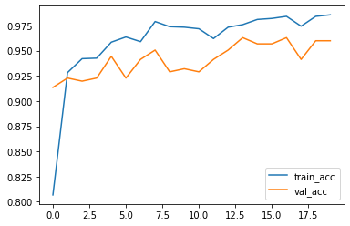
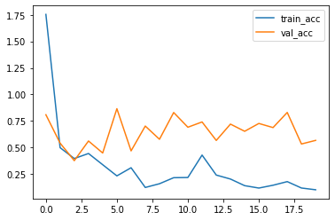
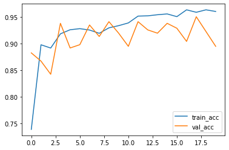
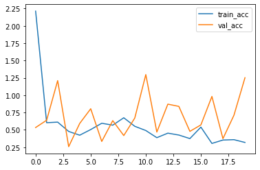
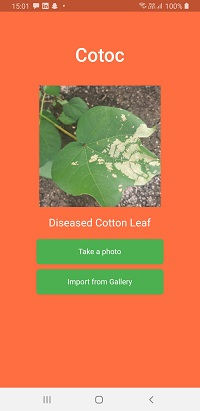

# Cotton Diseases Detection: Transfer Learning
>By Aayush Jain(Darkshadow)

* Created a Deep Learning Pipeline which will use pre-trained models(transfer learning) for making predctions on cotton diseased plants.
* The datasets consists of images of cotton plants with diseases.

---

## Code and Resources used:
**Python:** 3.7  
**Libraries Used:** Tensorflow, numpy, glob
**Tensorflow Version:** 2.2.0
**Link of Dataset:** [Dataset](https://drive.google.com/drive/folders/1vdr9CC9ChYVW2iXp6PlfyMOGD-4Um1ue)

---

## Model Description:
* We have used two pre-built models called Resnet15 and InceptionV3.
* They are available in Tensorflow keras api and also in the link given below.
* To get Resnet152V2 trained model : [RESNET15V2](https://drive.google.com/file/d/1-qd_OvSipHW2Br6heUt0oUyFv9ip9v2K/view?usp=sharing)
* To get InceptionV3 trained model : [INCEPTIONV3](https://drive.google.com/file/d/1044nklmNLxIYQnMPT5e8jD_vVY10n73g/view?usp=sharing)

---

##  Accuracy and Loss:

---

## Model Accuracy 
* After training the data, watching the training accuracy and validation accuracy we can say that both the models are having almost same accuracy that's training accuracy ~98% and validation accuracy ~96%.

---

## Production
* For production we can use InceptionV3 as it has less trainable parameters and we get similar accuracy as Resnet152V2 which as comparitively much high trainable parameters.

---

## How to Run:
* To run the project:
* Step1: Fork the repo. to your local machine.
* Step2: Go to Cotton Diseases folder.
* Step3: Type command "python -m http.server 8000".
* Step4: Open browser and go to "localhost:8000".

### Note: You can also run the project by going to VSCode and then "Go Live".

---

